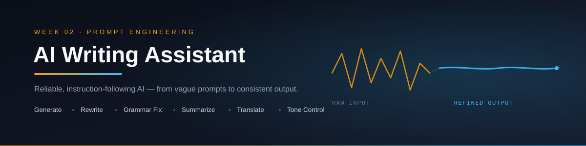

<p align="center">
  
</p>

<p align="center">
  
  
  
  
  
  
  
  
</p>

<p align="center">
  A reliable, instruction-following AI writing tool — covering prompt engineering, system instructions, few-shot learning, and prompt evaluation.<br/>
  Second deliverable of a <b>90-day AI Engineering roadmap</b> (Phase 1: Foundation, Week 2).
</p>

---

## 📑 Table of Contents

- [Overview](#-overview)
- [Features](#-features)
- [Demo](#-demo)
- [Installation](#️-installation)
- [How to Run](#️-how-to-run)
- [Architecture](#️-architecture)
- [Prompt Design Approach](#-prompt-design-approach)
- [Folder Structure](#-folder-structure)
- [Future Improvements](#-future-improvements)
- [Roadmap Context](#-roadmap-context)
- [Author](#-author)
- [License](#-license)

---

## 📖 Overview

**AI Writing Assistant** takes the assistant built in Week 1 a step further — moving from a simple Q&A bot to a reliable, instruction-following tool. The focus this week is entirely on **prompt engineering as an engineering discipline**: writing clear instructions, giving the model consistent personas via system prompts, using reusable templates, teaching behavior through few-shot examples, and — critically — testing and evaluating prompts before shipping them.

This is **Repo 2 of 10+** in a structured 90-day AI Engineering roadmap, moving from LLM fundamentals → agentic systems → deployable AI products.

---

## ✨ Features

- ✍️ **Generate** — draft new text from a topic or brief
- 🔁 **Rewrite** — rephrase existing text while preserving meaning
- ✅ **Grammar Fix** — correct grammar and clarity issues
- 📝 **Summarize** — condense long text into key points
- 🌐 **Translate** — convert text between languages
- 🎚️ **Tone Control** — Professional, Friendly, Formal, Simple, Persuasive
- 🧩 **Reusable prompt templates** — separated from application code
- 🧪 **Prompt evaluation workflow** — multiple prompt variants tested against the same inputs before selecting a production prompt

---

## 🎥 Demo

*(Add a screenshot or short GIF/video here once available)*

```
assets/screenshots/
```

---

## 🛠️ Installation

```bash
# 1. Clone the repository
git clone https://github.com/Hamna-Munir/02-AI-Writing-Assistant.git
cd 02-AI-Writing-Assistant

# 2. Create a virtual environment
python -m venv venv
source venv/bin/activate      # On Windows: venv\Scripts\activate

# 3. Install dependencies
pip install -r requirements.txt

# 4. Configure environment variables
cp .env.example .env
# then add your OPENAI_API_KEY and GEMINI_API_KEY
```

---

## ▶️ How to Run

```bash
# Run the assistant directly
python src/main.py

# Or run it as an API server
uvicorn src.main:app --reload
```

Once running, the API will be available at:
```
http://127.0.0.1:8000/write
```

---

## 🏗️ Architecture

```
User Input + Selected Mode (Generate / Rewrite / Grammar / Summarize / Translate)
   │
   ▼
Prompt Template Layer (prompts.py)
   │  — injects system instructions + tone + few-shot examples
   ▼
LLM Client (OpenAI / Gemini)
   │
   ▼
Structured Output Parser (models.py)
   │
   ▼
Response → User
```

---

## 🧪 Prompt Design Approach

Every writing mode in this assistant follows a consistent prompt-engineering process:

1. **Draft** — write an initial instruction (system + user prompt)
2. **Template-ize** — extract variables (tone, text, target mode) into reusable templates
3. **Few-shot where needed** — add input → output examples for modes needing consistency (tone, style)
4. **Evaluate** — test 2–3 prompt variants against the same 5 sample inputs, scoring accuracy, clarity, and consistency
5. **Ship** — the best-performing variant becomes the production prompt in `prompts.py`

This evaluation table format is used throughout `notes/day-13.md`:

| Prompt | Accuracy | Clarity | Consistency |
|---|---|---|---|
| A | | | |
| B | | | |
| C | | | |

---

## 📂 Folder Structure

```
02-AI-Writing-Assistant/
│
├── README.md
├── LICENSE
├── .gitignore
├── requirements.txt
├── .env.example
│
├── docs/
│   └── week-02-summary.md
│
├── notes/
│   ├── day-08.md
│   ├── day-09.md
│   ├── day-10.md
│   ├── day-11.md
│   ├── day-12.md
│   ├── day-13.md
│   └── day-14.md
│
├── assets/
│   ├── banner.svg
│   └── screenshots/
│
├── tests/
│   └── test_assistant.py
│
├── src/
│   ├── __init__.py
│   ├── main.py
│   ├── assistant.py
│   ├── config.py
│   ├── prompts.py
│   ├── models.py
│   ├── memory.py
│   └── utils.py
│
└── journal.md
```

---

## 🚀 Future Improvements

- [ ] Add streaming responses for long-form generation
- [ ] Add batch prompt evaluation script (automate the Day 13 table)
- [ ] Add more tone presets
- [ ] Deploy as a hosted API (Phase 1 wrap-up)
- [ ] Expand test coverage

---

## 🧭 Roadmap Context

This project is **Week 2 of Phase 1** in a 90-day AI Engineering roadmap:

| Phase | Focus | Days |
|---|---|---|
| Phase 1 | Foundation — AI Personal Assistant → AI Writing Assistant | 1–30 |
| Phase 2 | Agent Engineering — RAG, LangGraph, MCP | 31–60 |
| Phase 3 | Business AI Systems — Multi-Agent, Deployment | 61–90 |

---

## 👩‍💻 Author

**Hamna Munir**
Software Engineering & AI/ML Student | Building deployable AI/ML projects

- GitHub: [@Hamna-Munir](https://github.com/Hamna-Munir)
- Hugging Face: [@Hamna27](https://huggingface.co/Hamna27)

---

## 📄 License

This project is licensed under the MIT License — see the [LICENSE](LICENSE) file for details.
